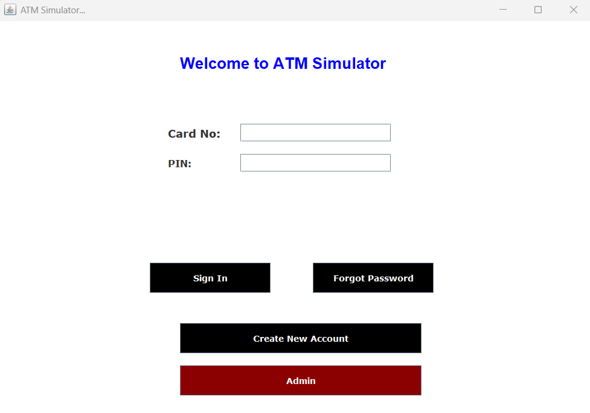
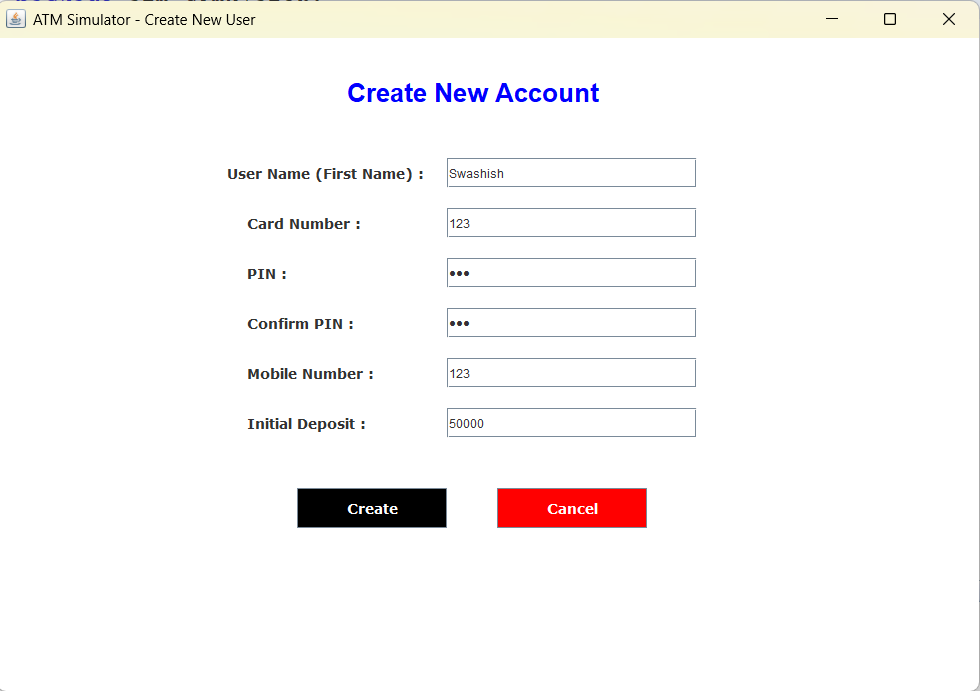
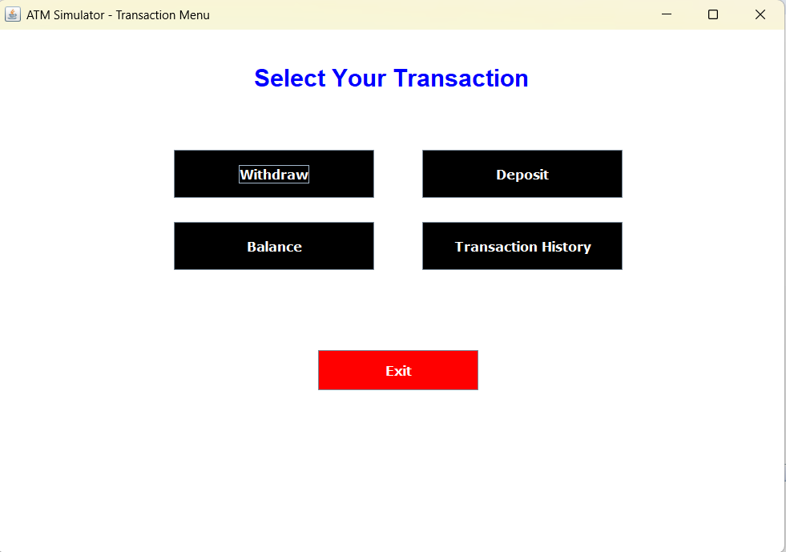
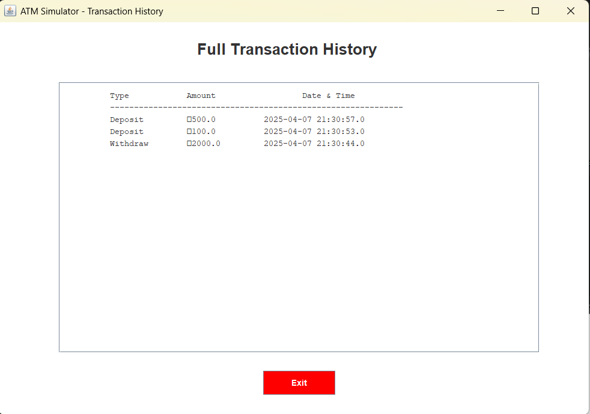
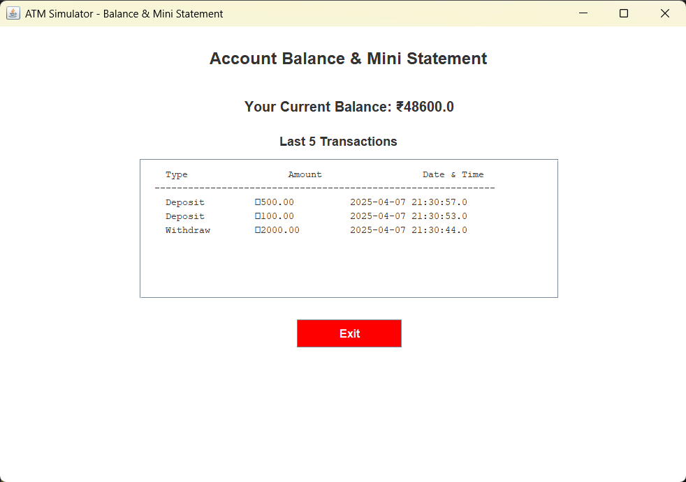

# 💳 ATM Simulator (Java + MySQL + Swing GUI)

A simple ATM Simulator desktop application built using **Java (Swing)** and **MySQL**. It allows users to perform ATM-like operations such as login, withdraw, deposit, view balance, and view mini statements. It also includes an **Admin Panel** to manage users and transactions.

---

## 🚀 Features

### 👤 User Panel
- Login with card number and PIN
- Withdraw money
- Deposit money
- Check balance
- View mini statement (last 5 transactions)

### 🔐 Admin Panel
- Truncate or drop tables (`users`, `transactions`)
- Edit user balance
- Exit to Dashboard

---

## 🛠️ Technologies Used

- **Java (Swing)** – GUI for frontend
- **MySQL** – Backend database
- **JDBC** – Java Database Connectivity for SQL queries
- **NetBeans IDE** – Recommended IDE for development

---

## 📂 Project Structure

## 📸 Screenshots

### 🏧 ATM Simulator

### 👤 Create User

### 🧾 Dashboard

### 💸 Transaction History

### 💰 Balance Inquiry

